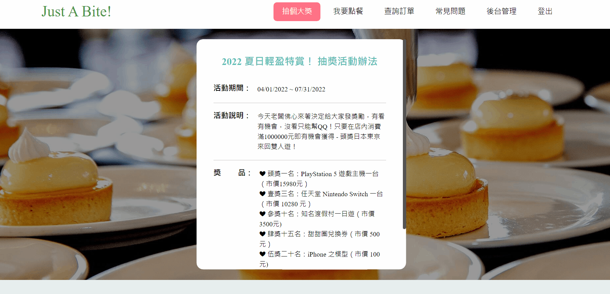

# Express 餐廳網站

連結：https://peanu-restaurant.herokuapp.com/

- 測試帳號：peanu
- 測試密碼：peanu

附註：這個專案是部署在 Heroku 上，所以太久沒開的話可能會需要等待一下（冷卻機制）。

## 這是什麼？

這是用 Express 和 Sequelize 製作的餐廳官網網站。

主要的功能有：

- Landing Page
- 登入機制
- 抽獎活動
- 管理公告訊息（後台）
- 管理抽獎品項和機率（可以新增、編輯、刪除、設定獎項機率）
- RWD

附註：抽獎的 API 是自己寫的，接著在透過前端 JavaScript 來串接。

未來希望添加的功能：

- 管理 FAQ 內容
- 菜單列表頁面
- 購物車
- 新增訂單
- 查詢訂單
- 金流功能

## 使用技術

- Express
- sequelize 連接資料庫（ORM）
- MySQL 資料庫
- EJS 模板引擎
- MVC 架構
- prettier 排版，維持 code 一致性

## 網站預覽

### 首頁

### 登入

### 抽獎

### 設定抽獎項目

### 設定公告訊息

